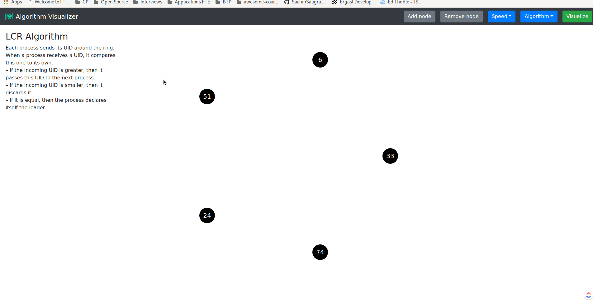

# Distributed Algorithm Visualizer

A distributed algorithm visualizer written in Javascript using **React**. I have been reading up on various distributed algorithms recently. Moreover I have been trying my hands on various frontend frameworks like React and Ember. Hence, I decided to put my gained knowledge into use and build this application. It makes it easy and fun to learn distributed algorithms by interactive visualizations.

The site is live on **Github pages** and can be accessed at [https://srv-twry.github.io/distributed-algorithm-visualizer](https://srv-twry.github.io/distributed-algorithm-visualizer).

## Supported Algorithms
- LCR Algorithm

## Future Plans
- HS Algorithm

## Development

In the project directory, you can run:

### `npm start`

Runs the app in the development mode. 
Open [http://localhost:3000](http://localhost:3000) to view it in the browser.

The page will reload if you make edits. 
You will also see any lint errors in the console.

### `npm test`

Launches the test runner in the interactive watch mode. 
See the section about [running tests](https://facebook.github.io/create-react-app/docs/running-tests) for more information.

Liked it? :heart_eyes: Leave a star! :star: